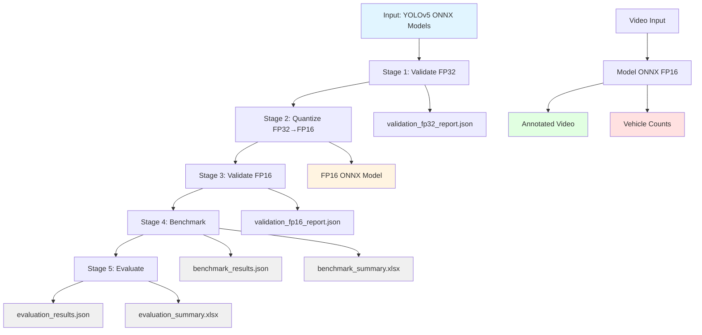
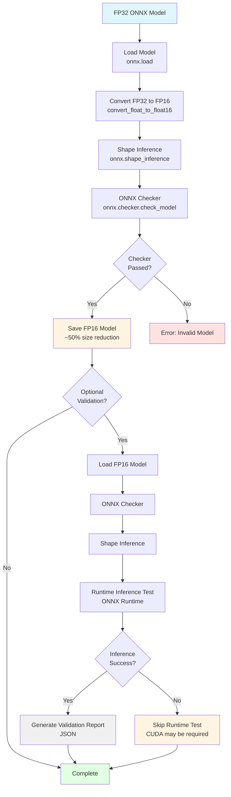
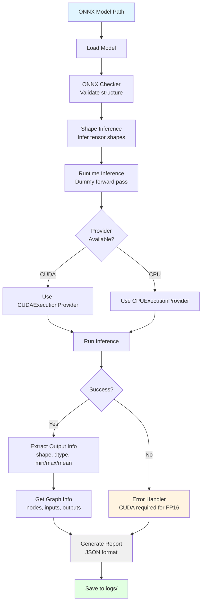

# YOLOv5 FP32 to FP16 Quantization Pipeline

## Project Overview

This project implements an end-to-end pipeline for quantizing YOLOv5 object detection models from FP32 to FP16 precision. The pipeline includes model validation, performance benchmarking, accuracy evaluation, and a traffic analysis demo.

### Purpose

- Convert YOLOv5 ONNX models to optimized FP16 format
- Validate model correctness at each stage
- Measure performance improvements (latency, throughput, memory)
- Evaluate detection accuracy using COCO metrics
- Support deployment optimization for edge devices with GPU acceleration
- Demonstrate traffic analysis with vehicle detection and counting

### Features

- **ONNX Validation**: Validate ONNX models for correctness and runtime compatibility
- **FP16 Quantization**: Convert FP32 ONNX models to FP16 using `onnxconverter_common`
- **Performance Benchmarking**: Measure latency, throughput, and memory usage
- **Accuracy Evaluation**: Compute COCO metrics (Precision, Recall, mAP50, mAP50-95)
- **Batch Processing**: Benchmark and evaluate multiple models automatically
- **Traffic Analysis Demo**: Vehicle detection and counting from video
- **Modular Architecture**: Clean separation of concerns for easy extension

### Technologies

- **Python 3.9**
- **ONNX 1.15+** - Model interchange format
- **ONNX Runtime** - Model inference and validation
- **onnxconverter-common** - FP16 quantization
- **OpenCV** - Image and video processing
- **pycocotools** - COCO dataset evaluation
- **pandas** - Data manipulation and Excel export
- **Matplotlib** - Visualization (optional)

---

## Project Structure

```
quantization-yolov5/
├── src/                            # Source code
│   ├── core/                       # Core utilities
│   │   ├── config.py               # Centralized configuration
│   │   ├── path_setup.py           # Python path setup
│   │   └── base.py                 # Base classes
│   │
│   ├── quantization/               # Quantization module
│   │   ├── fp16.py                 # FP32 → FP16 conversion
│   │   ├── validator.py            # ONNX model validation
│   │   └── run.py                  # CLI entry point
│   │
│   ├── benchmarking/               # Benchmarking module
│   │   ├── benchmark.py            # Core benchmarking logic
│   │   ├── reporter.py             # Report generation (JSON/Excel)
│   │   └── run.py                  # CLI entry point
│   │
│   ├── evaluation/                 # Evaluation module
│   │   ├── evaluator.py            # COCO evaluation metrics
│   │   ├── reporter.py             # Report generation (JSON/Excel)
│   │   └── run.py                  # CLI entry point
│   │
│   ├── inference/                  # Inference utilities
│   │   ├── detector.py             # YOLO model wrapper for inference
│   │   ├── counter.py              # Vehicle counting logic
│   │   └── video_utils.py          # Video I/O and processing
│   │
│   ├── preprocessing/              # Preprocessing
│   │   └── preprocessor.py         # Image preprocessing
│   │
│   └── postprocessing/             # Postprocessing
│       ├── detections.py           # Detection handling
│       └── nms.py                  # Non-maximum suppression
│
├── app/                            # Demo application
│   └── run_demo.py                 # Traffic analysis demo entry point
│
├── weights/                        # Model weights directory
│   ├── best_decoded.onnx           # FP32 ONNX model
│   ├── best_decoded_fp16.onnx      # FP16 ONNX model
│   ├── magnitude_0.3_decoded.onnx
│   ├── magnitude_0.3_decoded_fp16.onnx
│   ├── magnitude_0.5_decoded.onnx
│   ├── magnitude_0.5_decoded_fp16.onnx
│   ├── magnitude_0.7_decoded.onnx
│   └── magnitude_0.7_decoded_fp16.onnx
│
├── reports/                        # Output reports
│   ├── benchmark_summary.xlsx      # Benchmark results (all models)
│   ├── evaluation_summary.xlsx     # Evaluation results (all models)
│   └── *.json                      # Individual model reports
│
├── logs/                           # Pipeline logs
│   └── *_validation_report.json    # ONNX validation reports
│
├── output/                         # Traffic analysis output
│   └── *.mp4                       # Annotated videos
│
├── requirement.yml                 # Conda environment specification
├── .gitignore                      # Git ignore rules
└── README.md                       # This file
```

---

## Workflow

### High-Level Pipeline

```
Project
│
├── Stage 1: Validate ONNX FP32
│   └── Verify ONNX model correctness
│
├── Stage 2: Quantize FP32 → FP16
│   └── Apply FP16 quantization
│
├── Stage 3: Validate ONNX FP16
│   └── Verify quantized model correctness
│
├── Stage 4: Benchmark FP32 vs FP16
│   └── Measure performance improvements
│
├── Stage 5: Evaluate Accuracy
│   └── Compute COCO metrics (mAP, Precision, Recall)
│
└── Stage 6: Traffic Analysis Demo
    └── Vehicle detection and counting
```

### Mermaid Flowchart



---

## Execution

### Prerequisites

1. **Conda environment** (recommended):
   ```bash
   conda env create -f requirement.yml
   conda activate .venv-quant
   ```

2. **Dataset** (for benchmarking and evaluation):
   - Place test images in `dataset/coco2017/val2017/`
   - Place COCO annotations in `dataset/coco2017/annotations/instances_val2017.json`
   - Supports: .jpg, .jpeg, .png, .bmp, .tiff, .webp

### Running the Pipeline

#### 1. Quantize Models

Convert FP32 ONNX models to FP16:

```bash
python src/quantization/run.py --model best_decoded
```

With validation:
```bash
python src/quantization/run.py --model best_decoded --validate
```

Validate existing model:
```bash
python src/quantization/run.py --validate-only weights/best_decoded.onnx
```

Output:
- `weights/{model}_fp16.onnx` - Quantized FP16 model
- `logs/{model}_validation_report.json` - Validation report (if --validate used)

**Quantization Workflow (FP32 → FP16):**



**Validation Workflow Details:**



#### 2. Benchmark 
##### Benchmark all Models

Scan weights/ directory for all model pairs, run benchmarks, and export results:

```bash
python src/benchmarking/run.py --all
```

Output:
- `reports/*_benchmark_results.json` - Individual benchmark reports
- `reports/benchmark_summary.xlsx` - Summary Excel with all models

###### Benchmark Single Model

```bash
python src/benchmarking/run.py --model best_decoded
```

With custom iterations:
```bash
python src/benchmarking/run.py --model best_decoded --iterations 200 --warmup 20
```

#### 4. Evaluate Models

Scan weights/ directory for all model pairs, run COCO evaluation, and export results:
##### Evaluate all models
```bash
python src/evaluation/run.py --all
```

Output:
- `reports/*_evaluation_results.json` - Individual evaluation reports
- `reports/evaluation_summary.xlsx` - Summary Excel with mAP metrics

##### Evaluate Single Model

```bash
python src/evaluation/run.py --model best_decoded
```

With custom thresholds:
```bash
python src/evaluation/run.py --model best_decoded --conf 0.30 --iou 0.50 --max-images 1000
```

#### 6. Traffic Analysis Demo

Run vehicle detection and counting on video:

```bash
python app/run_demo.py --video dataset/video.mp4
```

With specific model:
```bash
python app/run_demo.py --video dataset/video.mp4 --model weights/best_decoded_fp16.onnx
```

With options:
```bash
python app/run_demo.py \
    --video input.mp4 \
    --model weights/best_decoded_fp16.onnx \
    --output output/my_result.mp4 \
    --conf 0.25 \
    --iou 0.45 \
    --show-preview \
    --max-frames 500
```

Output:
- Annotated video with bounding boxes and counts
- Console output with vehicle counts per class

---

## Outputs

### Generated Files

#### Benchmark Reports

| File | Description |
|------|-------------|
| `reports/benchmark_summary.xlsx` | Summary of all model benchmarks |
| `reports/{model}_benchmark_results.json` | Individual benchmark results |

**Excel Columns:**
- Model, Precision, Size (MB), Avg Latency (ms), Min/Max Latency, Std, P95, P99
- FPS, Peak Memory (MB), Avg Memory (MB), Notes

#### Evaluation Reports

| File | Description |
|------|-------------|
| `reports/evaluation_summary.xlsx` | Summary of all model evaluations |
| `reports/{model}_evaluation_results.json` | Individual evaluation results |

**Excel Columns:**
- Model, Precision, Recall, mAP50, mAP50-95, Num Images, Num Predictions, Eval Time, Notes

#### Validation Reports

| File | Description |
|------|-------------|
| `logs/{model}_validation_report.json` | ONNX model validation results |

**Report Contents:**
- Checker pass/fail status
- Runtime inference test results
- Model metadata (inputs, outputs, opset)

#### Traffic Analysis

| File | Description |
|------|-------------|
| `output/traffic_analysis_{video_name}.mp4` | Annotated video with detections and counts |

**Console Output:**
```
VEHICLE COUNT SUMMARY
car            :  152
motorcycle     :  287
bus            :   14
truck          :   26
bicycle        :    0
------------------------------------------------------------
TOTAL          :  479
```

---

## Configuration

### Centralized Configuration

All configuration is in `src/core/config.py`:

```python
# Model paths
MODELS_DIR = "weights"
DATASET_DIR = "dataset/coco2017/val2017"

# Quantization parameters
QUANTIZATION_CONFIG = {
    "min_positive_val": 1e-7,
    "max_finite_val": 3.4e+38,
    "keep_io_types": False,
    "disable_shape_infer": False,
}

# Benchmark parameters
BENCHMARK_CONFIG = {
    "warmup_iterations": 10,
    "num_iterations": 100,
    "batch_size": 1,
    "conf_threshold": 0.25,
    "iou_threshold": 0.45,
}

# Model parameters
MODEL_CONFIG = {
    "input_size": 640,
    "num_classes": 80,
    "conf_threshold": 0.25,
    "iou_threshold": 0.45,
}

# Traffic analysis configuration
TRAFFIC_CONFIG = {
    "vehicle_class_ids": [1, 2, 3, 5, 7],  # bicycle, car, motorcycle, bus, truck
    "conf_threshold": 0.25,
    "iou_threshold": 0.45,
    "colors": {
        "car": (0, 255, 0),
        "truck": (0, 165, 255),
        "bus": (0, 0, 255),
        "motorcycle": (255, 0, 0),
        "bicycle": (255, 255, 0),
    },
}
```

---

## Module Description

### src/core/config.py

**Purpose**: Centralized configuration management.

**Key Components**:
- Project path definitions
- Quantization parameters
- Benchmarking parameters
- Model parameters (YOLOv5, COCO classes)
- Traffic analysis configuration
- ONNX export settings
- ONNX Runtime provider selection
- Utility functions for directory creation

### src/quantization/run.py

**Purpose**: CLI entry point for quantization workflow.

**Key Features**:
- FP32 to FP16 conversion
- Optional ONNX validation
- Support for model names or direct paths
- Validation-only mode for existing models

**Usage Examples**:
```bash
python src/quantization/run.py --model best_decoded
python src/quantization/run.py --model best_decoded --validate
python src/quantization/run.py --validate-only weights/model.onnx
```

### src/benchmarking/run.py

**Purpose**: CLI entry point for benchmarking workflow.

**Key Features**:
- Single model or batch benchmarking
- FP32 vs FP16 comparison
- Automatic model pair detection
- Excel and JSON report generation

**Usage Examples**:
```bash
python src/benchmarking/run.py --model best_decoded
python src/benchmarking/run.py --all
python src/benchmarking/run.py --model best_decoded --iterations 200
```

### src/evaluation/run.py

**Purpose**: CLI entry point for evaluation workflow.

**Key Features**:
- COCO metric computation
- Single model or batch evaluation
- FP32 vs FP16 accuracy comparison
- Excel and JSON report generation

**Usage Examples**:
```bash
python src/evaluation/run.py --model best_decoded
python src/evaluation/run.py --all
python src/evaluation/run.py --model best_decoded --max-images 1000
```

### src/inference/detector.py

**Purpose**: YOLO model wrapper for inference.

**Key Components**:
- `YOLODetector` class - Model loading and inference
- `detect()` - General object detection
- `detect_vehicles()` - Vehicle-only detection
- Automatic handling of different ONNX output formats

### src/inference/counter.py

**Purpose**: Vehicle counting logic.

**Key Components**:
- `VehicleCounter` class - Track counts per class
- `SimpleCounter` class - Frame-level counting
- Statistics tracking and reporting

### src/inference/video_utils.py

**Purpose**: Video I/O and processing.

**Key Components**:
- `VideoProcessor` class - Video reading/writing
- `draw_detections()` - Draw bounding boxes
- `draw_counts()` - Draw vehicle counts on frame

### app/run_demo.py

**Purpose**: Traffic analysis demo entry point.

**Features**:
- Vehicle detection and counting
- Annotated video output
- Per-class statistics
- Modular design for future extensions

---


---

## Troubleshooting

### Issue: "Module not found"

**Solution**: Ensure you're running from the project root directory and all dependencies are installed. The scripts use `path_setup.py` to configure Python paths automatically.

### Issue: "CUDAExecutionProvider required for FP16"

**Solution**: FP16 inference requires CUDA-capable GPU. Use CPU for FP32 only, or run on GPU machine.

### Issue: "0 detections returned"

**Solution**: This was a known issue in earlier versions. The "decoded" ONNX models output 3 separate tensors (boxes, scores, class_ids) instead of a single [N, 85] tensor. This has been fixed in the current version. The detector now automatically handles both formats.

### Issue: "FP16 slower than FP32 on CPU"

**Solution**: This is expected behavior. FP16 quantization with `keep_io_types=False` causes CPU ONNX Runtime to perform additional type conversions. For CPU inference, FP32 may be faster. FP16 provides benefits on GPU with CUDAExecutionProvider.

### Issue: "Dataset not found"

**Solution**: Ensure the dataset directory exists at `dataset/coco2017/val2017/` with images and COCO annotations at `dataset/coco2017/annotations/instances_val2017.json`.

---

