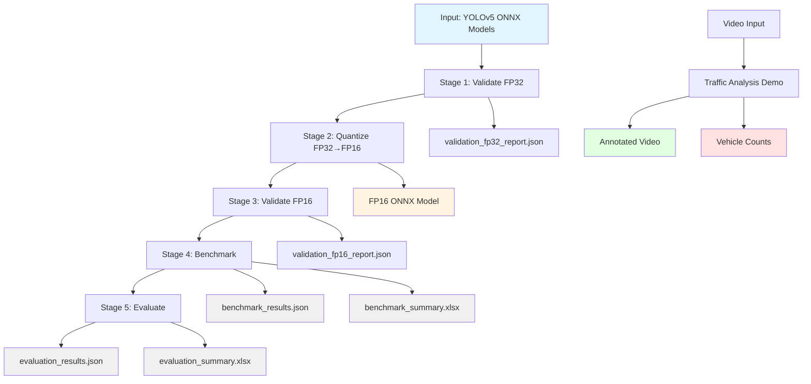

# YOLOv5 FP32 to FP16 Quantization Pipeline

## Project Overview

This project implements an end-to-end pipeline for quantizing YOLOv5 object detection models from FP32 to FP16 precision. The pipeline includes model validation, performance benchmarking, accuracy evaluation, and a traffic analysis demo.

### Purpose

- Convert YOLOv5 ONNX models to optimized FP16 format
- Validate model correctness at each stage
- Measure performance improvements (latency, throughput, memory)
- Evaluate detection accuracy using COCO metrics
- Support deployment optimization for edge devices with GPU acceleration
- Demonstrate traffic analysis with vehicle detection and counting

### Features

- **ONNX Validation**: Validate ONNX models for correctness and runtime compatibility
- **FP16 Quantization**: Convert FP32 ONNX models to FP16 using `onnxconverter_common`
- **Performance Benchmarking**: Measure latency, throughput, and memory usage
- **Accuracy Evaluation**: Compute COCO metrics (Precision, Recall, mAP50, mAP50-95)
- **Batch Processing**: Benchmark and evaluate multiple models automatically
- **Traffic Analysis Demo**: Vehicle detection and counting from video
- **Modular Architecture**: Clean separation of concerns for easy extension

### Technologies

- **Python 3.9**
- **ONNX 1.15+** - Model interchange format
- **ONNX Runtime** - Model inference and validation
- **onnxconverter-common** - FP16 quantization
- **OpenCV** - Image and video processing
- **pycocotools** - COCO dataset evaluation
- **pandas** - Data manipulation and Excel export
- **Matplotlib** - Visualization (optional)

---

## Project Structure

```
quantization-yolov5/
├── quantize/                      # Core quantization pipeline
│   ├── __init__.py
│   ├── config.py                  # Centralized configuration
│   ├── validate_onnx.py           # ONNX model validation
│   ├── quantize_fp16.py           # FP32 → FP16 conversion
│   └── visualize_benchmark.py     # Benchmark visualization
│
├── benchmark/                     # Benchmark modules
│   ├── __init__.py
│   ├── benchmark_core.py          # Common benchmark functions
│   ├── benchmark_all_models.py    # Scan all models, run benchmark, export xlsx
│   └── benchmark_single.py        # Single model benchmark (--model)
│
├── evaluation/                    # Evaluation modules
│   ├── __init__.py
│   ├── evaluation_core.py         # COCO evaluation metrics
│   ├── evaluate_all_models.py     # Scan all models, evaluate, export xlsx
│   └── evaluate_single.py         # Single model evaluation (--model)
│
├── app/                           # Demo application
│   └── main.py                    # Traffic analysis demo entry point
│
├── util/                          # Traffic analysis utilities
│   ├── __init__.py
│   ├── detector.py                # YOLO model wrapper for inference
│   ├── preprocess.py              # Image preprocessing
│   ├── postprocess.py             # Post-processing (NMS, filtering)
│   ├── counter.py                 # Vehicle counting logic
│   └── video_processor.py         # Video I/O and frame processing
│
├── weights/                       # Model weights directory
│   ├── magnitude_0.3_decoded.onnx              # FP32 ONNX model
│   ├── magnitude_0.3_decoded_fp16.onnx         # FP16 ONNX model
│   ├── magnitude_0.5_decoded.onnx
│   ├── magnitude_0.5_decoded_fp16.onnx
│   ├── magnitude_0.7_decoded.onnx
│   └── magnitude_0.7_decoded_fp16.onnx
│
├── reports/                       # Output reports
│   ├── benchmark_summary.xlsx     # Benchmark results (all models)
│   ├── evaluation_summary.xlsx    # Evaluation results (all models)
│   └── *.json                     # Individual model reports
│
├── logs/                          # Pipeline logs
│   ├── pipeline_log.txt
│   └── validation_*.json
│
├── output/                        # Traffic analysis output
│   └── traffic_analysis_output.mp4
│
├── requirement.yml                # Conda environment specification
├── .gitignore                     # Git ignore rules
└── README.md                      # This file
```

---

## Workflow

### High-Level Pipeline

```
Project
│
├── Stage 1: Validate ONNX FP32
│   └── Verify ONNX model correctness
│
├── Stage 2: Quantize FP32 → FP16
│   └── Apply FP16 quantization
│
├── Stage 3: Validate ONNX FP16
│   └── Verify quantized model correctness
│
├── Stage 4: Benchmark FP32 vs FP16
│   └── Measure performance improvements
│
├── Stage 5: Evaluate Accuracy
│   └── Compute COCO metrics (mAP, Precision, Recall)
│
└── Stage 6: Traffic Analysis Demo
    └── Vehicle detection and counting
```

### Mermaid Flowchart



---

## Execution

### Prerequisites

1. **Conda environment** (recommended):
   ```bash
   conda env create -f requirement.yml
   conda activate .venv-quant
   ```

2. **Dataset** (for benchmarking and evaluation):
   - Place test images in `dataset/coco2017/val2017/`
   - Place COCO annotations in `dataset/coco2017/annotations/instances_val2017.json`
   - Supports: .jpg, .jpeg, .png, .bmp, .tiff, .webp

### Running the Pipeline

#### 1. Benchmark All Models

Scan weights/ directory for all model pairs, run benchmarks, and export results:

```bash
python benchmark/benchmark_all_models.py
```

Output:
- `reports/*_benchmark_results.json` - Individual benchmark reports
- `reports/benchmark_summary.xlsx` - Summary Excel with all models

#### 2. Benchmark Single Model

```bash
python benchmark/benchmark_single.py --model magnitude_0.3_decoded
```

#### 3. Evaluate All Models

Scan weights/ directory for all model pairs, run COCO evaluation, and export results:

```bash
python evaluation/evaluate_all_models.py
```

Output:
- `reports/*_evaluation_results.json` - Individual evaluation reports
- `reports/evaluation_summary.xlsx` - Summary Excel with mAP metrics

#### 4. Evaluate Single Model

```bash
python evaluation/evaluate_single.py --model magnitude_0.3_decoded
```

#### 5. Traffic Analysis Demo

Run vehicle detection and counting on video:

```bash
python app/main.py --video path/to/input.mp4 --model weights/magnitude_0.3_decoded_fp16.onnx
```

With options:
```bash
python app/main.py \
    --video input.mp4 \
    --model weights/magnitude_0.3_decoded_fp16.onnx \
    --output output/my_result.mp4 \
    --conf-threshold 0.25 \
    --iou-threshold 0.45 \
    --show-preview \
    --max-frames 500
```

Output:
- Annotated video with bounding boxes and counts
- Console output with vehicle counts per class

---

## Outputs

### Generated Files

#### Benchmark Reports

| File | Description |
|------|-------------|
| `reports/benchmark_summary.xlsx` | Summary of all model benchmarks |
| `reports/{model}_benchmark_results.json` | Individual benchmark results |

**Excel Columns:**
- Model, Precision, Size (MB), Avg Latency (ms), Min/Max Latency, Std, P95, P99
- FPS, Peak Memory (MB), Avg Memory (MB), Notes

#### Evaluation Reports

| File | Description |
|------|-------------|
| `reports/evaluation_summary.xlsx` | Summary of all model evaluations |
| `reports/{model}_evaluation_results.json` | Individual evaluation results |

**Excel Columns:**
- Model, Precision, Recall, mAP50, mAP50-95, Num Images, Num Predictions, Eval Time, Notes

#### Traffic Analysis

| File | Description |
|------|-------------|
| `output/traffic_analysis_output.mp4` | Annotated video with detections and counts |

**Console Output:**
```
VEHICLE COUNT SUMMARY
car            :  152
motorcycle     :  287
bus            :   14
truck          :   26
bicycle        :    0
------------------------------------------------------------
TOTAL          :  479
```

---

## Configuration

### Centralized Configuration

All configuration is in `quantize/config.py`:

```python
# Model paths
MODELS_DIR = "weights"
DATASET_DIR = "dataset/coco2017/val2017"

# Quantization parameters
QUANTIZATION_CONFIG = {
    "min_positive_val": 1e-7,
    "max_finite_val": 3.4e+38,
    "keep_io_types": False,
    "disable_shape_infer": False,
}

# Benchmark parameters
BENCHMARK_CONFIG = {
    "warmup_iterations": 10,
    "num_iterations": 100,
    "batch_size": 1,
    "conf_threshold": 0.25,
    "iou_threshold": 0.45,
}

# Traffic analysis configuration
TRAFFIC_CONFIG = {
    "vehicle_class_ids": [1, 2, 3, 5, 7],  # bicycle, car, motorcycle, bus, truck
    "conf_threshold": 0.25,
    "iou_threshold": 0.45,
    "colors": {
        "car": (0, 255, 0),
        "truck": (0, 165, 255),
        "bus": (0, 0, 255),
        "motorcycle": (255, 0, 0),
        "bicycle": (255, 255, 0),
    },
}
```

---

## Module Description

### quantize/config.py

**Purpose**: Centralized configuration management.

**Key Components**:
- Project path definitions
- Quantization parameters
- Benchmarking parameters
- Model parameters (YOLOv5, COCO classes)
- Traffic analysis configuration
- ONNX export settings
- ONNX Runtime provider selection
- Utility functions for directory creation

### benchmark/benchmark_core.py

**Purpose**: Core benchmarking functionality.

**Key Components**:
- `InferenceMetrics` dataclass - Store metrics
- `ONNXInferenceBenchmark` class - Benchmark single model
- `load_test_images()` - Load test dataset
- `compare_benchmarks()` - Calculate improvements
- `save_results()` - Save JSON results
- `save_csv()` - Save CSV summary

**Metrics Collected**:
- Latency: avg, min, max, std, P95, P99 (ms)
- Throughput: FPS
- Memory: peak, average (MB)
- Model size: MB

### evaluation/evaluation_core.py

**Purpose**: COCO evaluation metrics computation.

**Key Components**:
- `COCOEvaluator` class - Full evaluation pipeline
- `evaluate_model()` - Convenience function
- `compute_coco_metrics()` - Compute metrics from predictions

**Metrics Computed**:
- Precision (AP at IoU=.50:.95)
- Recall (AR at IoU=.50:.95)
- mAP@0.50 (AP at IoU=.50)
- mAP@0.50:0.95 (AP at IoU=.50:.95)

### util/detector.py

**Purpose**: YOLO model wrapper for inference.

**Key Components**:
- `YOLODetector` class - Model loading and inference
- `detect()` - General object detection
- `detect_vehicles()` - Vehicle-only detection
- `preprocess()` - Image preprocessing
- `postprocess()` - Output post-processing

### util/counter.py

**Purpose**: Vehicle counting logic.

**Key Components**:
- `VehicleCounter` class - Track counts per class
- `SimpleCounter` class - Frame-level counting
- Statistics tracking and reporting

### util/video_processor.py

**Purpose**: Video I/O and processing.

**Key Components**:
- `VideoProcessor` class - Video reading/writing
- `draw_detections()` - Draw bounding boxes
- `draw_counts()` - Draw vehicle counts on frame

### app/main.py

**Purpose**: Traffic analysis demo entry point.

**Features**:
- Vehicle detection and counting
- Annotated video output
- Per-class statistics
- Modular design for future extensions

---

## Architecture Principles

### Clean Architecture

- **Separation of Concerns**: Each module has single responsibility
- **Modularity**: Easy to add new features without modifying existing code
- **Reusability**: Core functions in separate modules, imported by CLI scripts
- **Extensibility**: Traffic analysis designed for future features (tracking, speed estimation, etc.)

### Code Quality

- Type hints for all functions
- Comprehensive docstrings
- Consistent logging
- Centralized configuration
- Proper exception handling
- No duplicate code
- No hardcoded values

### Future Extensions

The traffic analysis module is designed to easily add:
- Multi-object tracking (ByteTrack, SORT)
- Speed estimation
- Lane detection
- Traffic statistics (flow, density)
- License plate detection
- License plate recognition (OCR)

To add a new feature:
1. Create new module in `util/` (e.g., `util/tracker.py`)
2. Import and integrate in `app/main.py`
3. Add configuration to `quantize/config.py` if needed
4. No changes to existing modules required

---

## Troubleshooting

### Issue: "Module not found"

**Solution**: Ensure you're running from the project root directory and all dependencies are installed.

### Issue: "CUDAExecutionProvider required for FP16"

**Solution**: FP16 inference requires CUDA-capable GPU. Use CPU for FP32 only, or run on GPU machine.

### Issue: "0 detections returned"

**Solution**: This was a known issue in earlier versions. The "decoded" ONNX models output 3 separate tensors (boxes, scores, class_ids) instead of a single [N, 85] tensor. This has been fixed in the current version. The detector now automatically handles both formats.

### Issue: "FP16 slower than FP32 on CPU"

**Solution**: This is expected behavior. FP16 quantization with `keep_io_types=False` causes CPU ONNX Runtime to perform additional type conversions. For CPU inference, FP32 may be faster. FP16 provides benefits on GPU with CUDAExecutionProvider.

---

## Recent Updates

### Model Output Format Fix (2026-06-26)

**Issue**: The detector was not handling the "decoded" model format correctly. The models output 3 separate tensors:
- boxes: [1, N, 4] - bounding box coordinates in corner format (x1, y1, x2, y2), normalized to [0, 1]
- scores: [1, N] - confidence scores
- class_ids: [1, N] - predicted class IDs

**Fix**: Updated `util/detector.py` to:
1. Detect when model outputs 3 tensors
2. Convert corner format to center format (cx, cy, w, h)
3. Scale coordinates from normalized [0, 1] to pixel coordinates (640x640)
4. Create [N, 85] format for post-processing pipeline

**Result**: Vehicle detection now works correctly with all models (FP32 and FP16).

### Demo Results

Successfully tested with `dataset/video_test.mp4`:
- **Model**: magnitude_0.3_decoded_fp16.onnx
- **Frames processed**: 100
- **Vehicles detected**: 1000
- **Breakdown**: 916 cars, 78 trucks, 6 buses
- **Average FPS**: ~3.2 FPS (CPU inference)
- **Output**: output/traffic_analysis_output.mp4 (3.0 MB)

The demo successfully displays:
- ✅ Confidence scores (e.g., 0.83, 0.81, 0.78)
- ✅ Class labels (car, truck, bus)
- ✅ Bounding boxes with color coding per class
- ✅ Vehicle counts per class
- ✅ Total vehicle count


